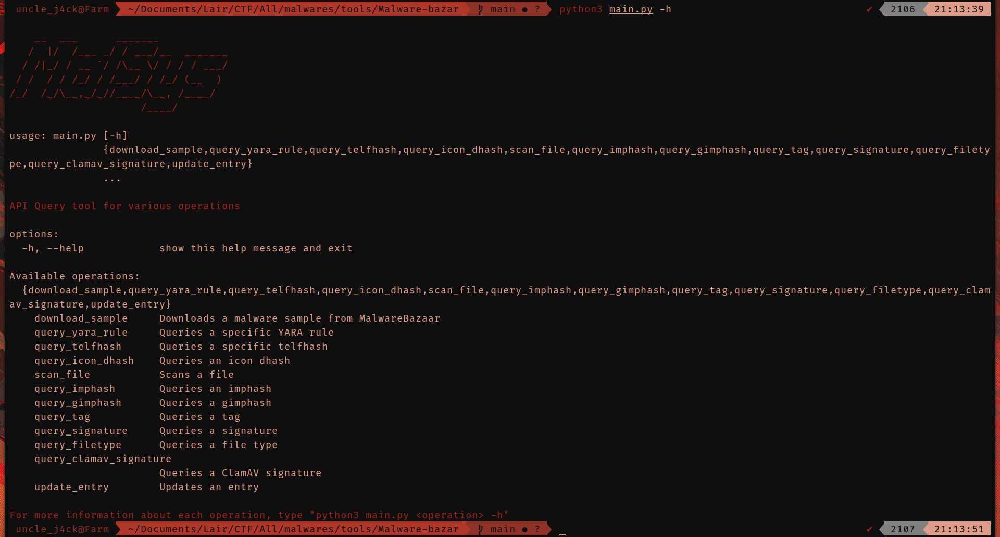
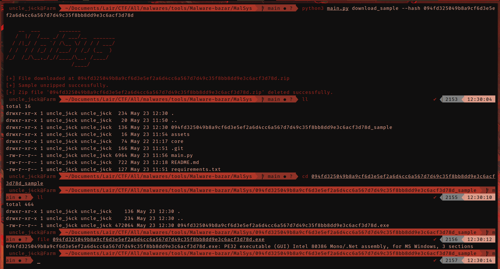
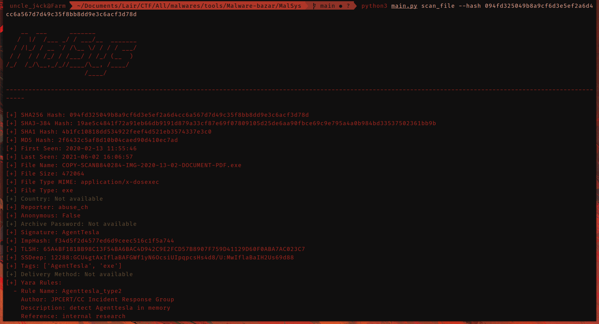
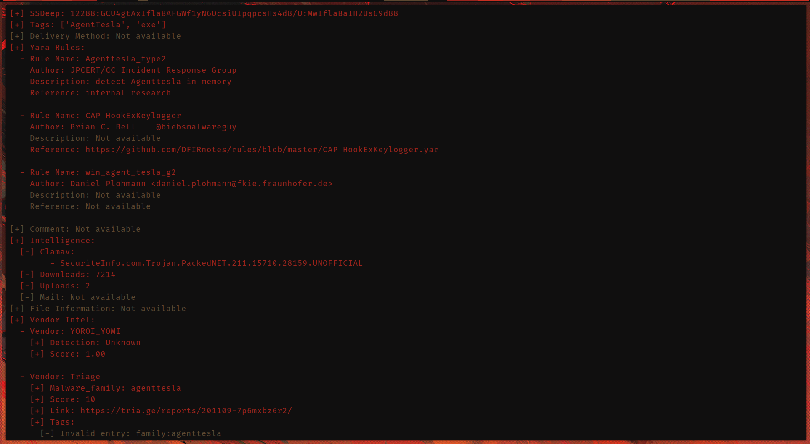
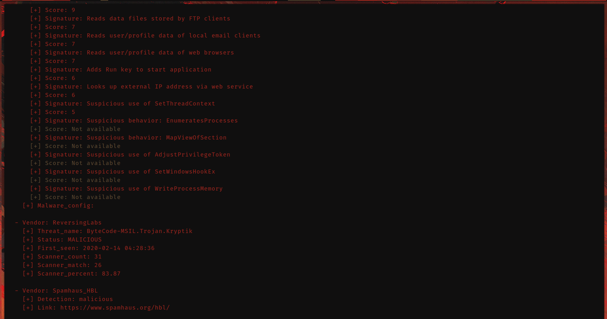
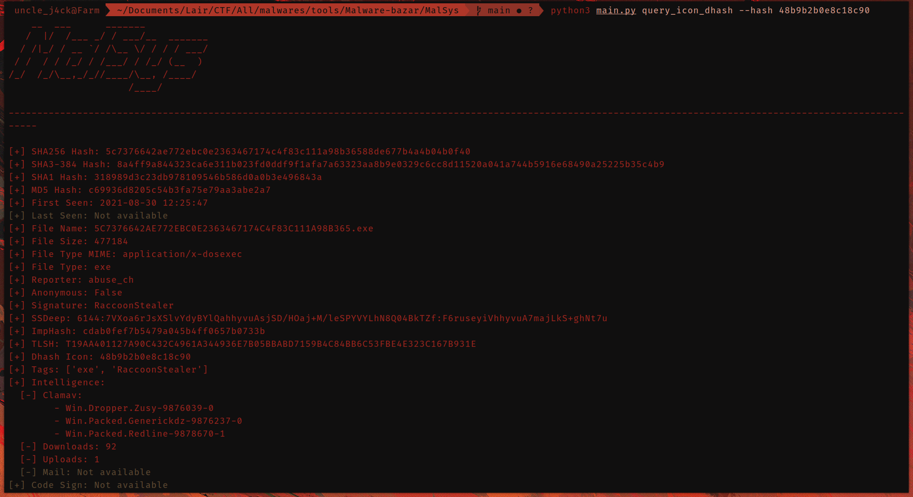
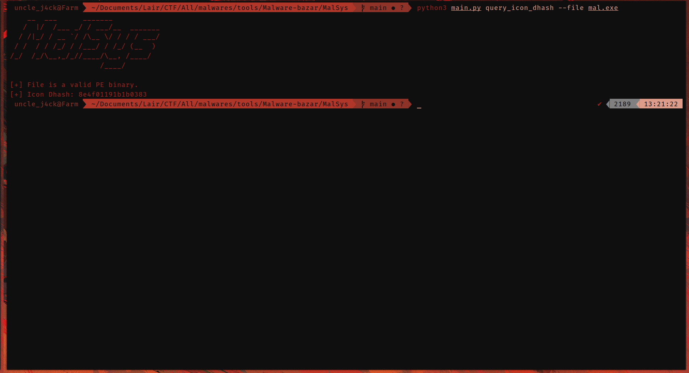

# MalSys


## Overview

MalSys is a versatile toolkit designed to assist in your malware analysis endeavors. As of now, it primarily leverages the , to retrieve information pertinent to a given file or hash. In essence, MalSys functions as a command line interface (CLI) tool that encapsulates most of the features available on the MalwareBazar API.

<p align="center">
  <a href="./assets/icon.png">
    
  </a>
</p>

## Installation

```Bash
git clone https://github.com/UncleJ4ck/MalSys
cd MalSys
pip3 install -r requirements.txt
python3 main.py
python3 main.py <operation> <arguments>
```

## Capabilities

- Download a sample from malware bazar

```Bash
python3 main.py download_sample --hash <SHA256 hash of the malware sample
```
> This command will download, unzip, and store the sample as a .exe or .bin file (or another format depending on the sample's filetype).

<p align="center">
  <a href="./assets/download.png">
    
  </a>
</p>

- Scans a file using a specified file path or hash

```Bash
python3 main.py scan_file --hash 'hash of the sample'
```
```Bash
python3 main.py scan_file --file 'path of the sample'
```
<p align="center">
  <a href="./assets/scan_1.png">
    
  </a>
</p>

<p align="center">
  <a href="./assets/scan_2.png">
    
  </a>
</p>

<p align="center">
  <a href="./assets/scan_3.png">
    
  </a>
</p>

- Query an icon dhash using a specified file or hash</summary>

```Bash
python3 main.py query_icon_dhash --hash 'hash'
```
> This command will query the hash using the MalwareBazar API.

<p align="center">
  <a href="./assets/dhash_1.png">
    
  </a>
</p>

```Bash
python3 main.py query_icon_dhash --file 'sample'
```
<p align="center">
  <a href="./assets/dhash_2.png">
    
  </a>
</p>

> The features within MalSys mirror those available on the MalwareBazar API website, and this holds true across all operations.

## TO-DO

- [-] Addition of other free API services such as AlienVault, etc.
- [-] Implementation of features like IOC scanning and Yara Generation
- [-] Bug fixes
- [-] Incorporation of live dynamic analysis via sandboxing and other methods